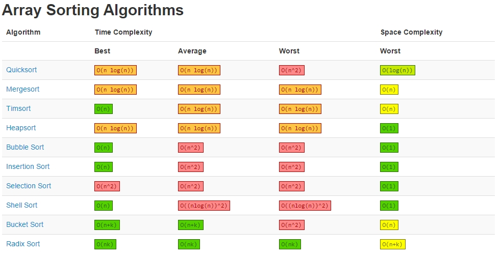

##1.选择排序

>**对于长度为N的数组，选择排序大约~N^2/2次比较N次交换**

####特点：
- *运行时间和输入无关，*主键全部相等的数组和一个元素随机排序的数组所用的时间一样长。
- *数据移动是最少的，*交换次数和数组的大小是线性关系，我们将研究的其他算法都不具备这个特征(大部分都是线性对数或是平方级别)

####总结:
- 稳定性:否
- 原地排序：是
  

##2.插入排序

>**对于随机排序的长度为N且主键不重复的数组,平均情况下需要~N^/4次比较以及~N^2/4次交换。最坏情况下需要~N^2次比较和~N^2次交换，最好情况下需要N-1次比较和0次交换**

####特点：
- *运行时间取决于输入元素的初始顺序，*如果对一个有序数组进行排序，会立即发现每个元素都已经在合适的位置上，它的运行时间是线性的。

####总结：
- 稳定性：是
- 是否原地排序：是

##3.希尔排序（插入排序的改进）
>**可以用于大型数组（可能比快排慢2倍，但是实现简单），对任意排序的数组表现也很好**

####总结：
- 稳定性：否
- 原地排序：是

##4.归并排序
>**1.对于长度为N的任意数组，自顶向下的归并排序需要1/2NlgN至NlgN次比较
2.对于长度为N的任意数组，自顶向下的归并排序最多需要访问数组6NlgN次
1、2-》归并排序所需的时间和NlgN成正比
3.对于长度为N的任意数组，自底向上的归并排序需要1/2NlgN至NlgN次比较，最多访问数组6NlgN次**

####总结：
- 稳定性：是
- 原地排序：否

##5.快速排序
>**1.将长度为N的无重复数组排序，快速排序平均需要~2NlnN次比较（以及1/6的交换）
2.快速排序最多需要约N^2/2次比较，但随机打乱数组可以预防这种情况。**

####总结：
- 稳定性:否
- 原地排序：是

##6.堆排序
>**将N个元素排序，堆排序只需少于（2NlgN+2N）次比较（以及一半次数的交换）**
####总结：
- 稳定性：否
- 原地排序：是

###时间复杂度总结表

##Reference
Blgo:http://bigocheatsheet.com/
Book:《Algorithms 4th Edition》 By:Robert Sedgewich & Kevin Wayne